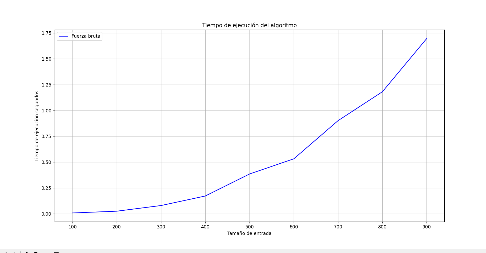

## Maximun sum of subarray
### Problem
This problem basically consists in finding a sublist of the input list whose sum of entries (items) is the largest.

### Solution
The solution I thought of was:

I thought that to find the sublist that meets the condition, I needed to iterate over each element considering every case, it means that my code consider all the possible combinations. In other words, it considers all the possible sublists that the list can have.

~~~python
sum_max = 0

"""
Here I define the variable that stores the maximun sum

Then here you can see that I use a nested for, 
this is to iterate over all the items in the list
"""

    for i in range(len(list)):
        for j in range(i, len(list)):
        #Here using the sum function I add all the items of every sublist
            current_sum = sum(list[i:j+1])
            #print(list[i:j+1])
            #print(current_sum)

            """
            Here there is a contidion that makes sure I 
            store the maximun sum as it changes.
            Also using the variable best_list I store the sublist
            whose sum is the largest
            """

            if current_sum > sum_max:
                sum_max = current_sum
                best_list = list[i:j+1]
    
    # Then this function prints both, the maximun sum and the sublist that owns it.
    print(best_list)
    print(sum_max)
~~~

**Note**: I did not use Kadane's Algorithm since it would not make sense use only one approach.

### Identifying time complexity

I have identified that the time complexity of my algorithm is O(n^2):

The graph below shows it:

